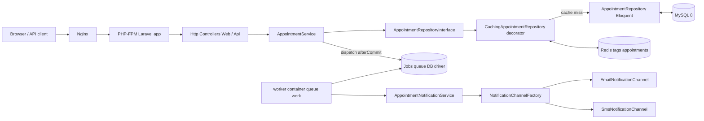
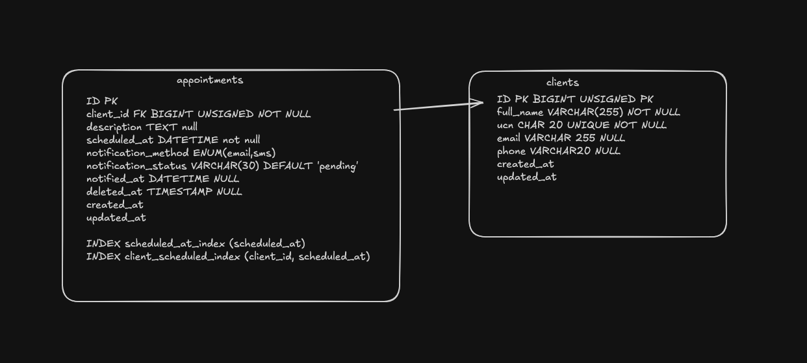

# Scheduling appointments — Docker (Laravel)

Local stack: **nginx**, **PHP 8.4-FPM**, **MySQL 8**, **phpMyAdmin**, **Redis**, and a **Laravel** app in [`laravel/`](laravel/).

## Architecture

The application is split into thin HTTP controllers, a service layer with business logic, and a repository layer abstracted behind interfaces. Writes are persisted synchronously while client notifications are dispatched to a background queue. Reads go through a cache decorator backed by Redis.



Key layers:

- **Controllers** ([`Web`](laravel/app/Http/Controllers/Web/AppointmentController.php), [`Api`](laravel/app/Http/Controllers/Api/AppointmentController.php)) — translate HTTP into validated payloads via Form Requests and delegate to services.
- **Services** ([`AppointmentService`](laravel/app/Services/AppointmentService.php), [`AppointmentNotificationService`](laravel/app/Services/AppointmentNotificationService.php)) — wrap business logic in DB transactions and orchestrate side-effects.
- **Repositories** ([`Contracts`](laravel/app/Repositories/Contracts/)) — bound in [`AppServiceProvider`](laravel/app/Providers/AppServiceProvider.php) to the Eloquent implementation, then transparently decorated with a Redis cache layer.
- **Background work** — `Appointment` writes dispatch [`SendAppointmentNotificationJob`](laravel/app/Jobs/SendAppointmentNotificationJob.php) on the `database` queue; the dedicated **worker** container in [`docker-compose.yml`](docker-compose.yml) runs `php artisan queue:work`.

## Dataset

Two tables model the domain: `clients` (deduplicated by UCN) and `appointments` (one client per appointment, soft-deletable). Indexes on `scheduled_at` and `(client_id, scheduled_at)` keep list and per-client queries fast. The schema is defined in [`laravel/database/migrations/`](laravel/database/migrations/).



## Requirements

- Docker Engine with Compose v2

## First run

From the repository root:

```bash
docker compose build
docker compose up -d
```

On the first start, the **php** service entrypoint will:

1. Create [`laravel/.env`](laravel/.env) from the root [`.env.example`](.env.example) baked into the image at build time (if `.env` is missing).
2. Run `composer install` if `vendor/` is missing.
3. Run `npm ci && npm run build` if Vite assets are missing (common with the bind-mounted `laravel/` directory).
4. Run `php artisan key:generate` when `APP_KEY` is empty.
5. Ensure `storage/` and `bootstrap/cache/` are writable by PHP-FPM (`www-data`).
6. Wait for MySQL, then run `php artisan migrate --force`.

The **php** image build runs `composer install` and `npm run build` so production-style images include compiled assets.

## URLs and ports (defaults)

| Service     | URL / port |
|------------|------------|
| Laravel app | http://localhost:8080 |
| phpMyAdmin | http://localhost:8081 |
| MySQL      | `127.0.0.1:33060` (user/password/database from env below) |
| Redis      | `127.0.0.1:63790` |

Override ports and DB credentials by copying [`.env.example`](.env.example) to **`.env`** at the repo root (Compose reads this file for variable substitution). The same template is used inside the PHP image for Laravel’s `.env` when the container creates it.

Default database: **database** `laravel`, **user** `laravel`, **password** `laravel`, **root password** `root`.

## Common commands

```bash
docker compose logs -f php
docker compose exec -w /var/www/html php php artisan migrate
docker compose exec -w /var/www/html php composer require some/package
docker compose down
```

If Laravel cannot write logs or cache (empty `storage/logs/laravel.log`, HTTP 500), fix permissions on a running stack:

```bash
docker compose exec php chown -R www-data:www-data storage bootstrap/cache
docker compose exec php chmod -R ug+rwx storage bootstrap/cache
```

Rebuild frontend assets inside the running container:

```bash
docker compose exec -w /var/www/html php npm ci
docker compose exec -w /var/www/html php npm run build
```

## Project layout

- [`docker-compose.yml`](docker-compose.yml) — services and healthchecks.
- [`docker/php/Dockerfile`](docker/php/Dockerfile) — PHP extensions, Composer, copies [`.env.example`](.env.example) into `/opt/laravel/` at build.
- [`docker/php/docker-entrypoint.sh`](docker/php/docker-entrypoint.sh) — Laravel bootstrap before `php-fpm`.
- [`docker/nginx/default.conf`](docker/nginx/default.conf) — nginx → PHP-FPM.
- [`docs/`](docs/) — diagrams and screenshots (e.g. database schema).

Highlights:

- `clients.ucn` is `CHAR(20) UNIQUE` so re-booking the same UCN updates the existing client row (see [`AppointmentService::upsertClient`](laravel/app/Services/AppointmentService.php)).
- `appointments.client_id` uses `restrictOnDelete` — a client cannot be hard-deleted while appointments reference it.
- `appointments` uses `softDeletes()`; deleted rows are excluded from list queries.
- `notification_status` defaults to `pending` and transitions to `sent` / `failed` via the queue worker.

## Queue

Sending notifications (Email / SMS) is decoupled from the request lifecycle so the HTTP response stays fast and notifications are retried on failure.

- After every appointment create/update, [`AppointmentService::finalizeAndNotify`](laravel/app/Services/AppointmentService.php) dispatches [`SendAppointmentNotificationJob`](laravel/app/Jobs/SendAppointmentNotificationJob.php) with `->afterCommit()` so the job only runs once the database transaction succeeds.
- The queue connection is `database` (see `QUEUE_CONNECTION` in [`.env.example`](.env.example)), backed by the `jobs` table from migration [`0001_01_01_000002_create_jobs_table.php`](laravel/database/migrations/0001_01_01_000002_create_jobs_table.php).
- The dedicated `worker` service in [`docker-compose.yml`](docker-compose.yml) runs `php artisan queue:work --tries=3 --timeout=60 --sleep=1`. The job itself declares `public int $tries = 3` and a backoff of `[10, 30, 60]` seconds.
- The job handler is thin: it calls [`AppointmentNotificationService::send`](laravel/app/Services/AppointmentNotificationService.php), which uses an `IdempotencyService` (Redis-based lock) keyed by `appointment-notification:{id}` so duplicate dispatches don't double-send. It then picks the right channel via [`NotificationChannelFactory`](laravel/app/Notifications/NotificationChannelFactory.php) (`email` or `sms`) and updates `notification_status` + `notified_at`.
- On terminal failure (after retries) `failed()` logs the error and marks the appointment as `failed`.

Inspect queue activity locally:

```bash
docker compose logs -f worker
docker compose exec -w /var/www/html php php artisan queue:failed
```

## Cache (decorator pattern)

Reads of appointments and clients go through a transparent caching layer that wraps the Eloquent repositories. This keeps the service layer agnostic of caching while letting the cache invalidate itself on writes.

- [`AppServiceProvider::register`](laravel/app/Providers/AppServiceProvider.php) binds the interfaces to the Eloquent implementations and then `extend()`s the binding to wrap each repository in its caching decorator:

  ```42:42:laravel/app/Providers/AppServiceProvider.php
              fn (AppointmentRepositoryInterface $repository, $app): CachingAppointmentRepository => new CachingAppointmentRepository(
  ```

- [`CachingAppointmentRepository`](laravel/app/Repositories/Cache/CachingAppointmentRepository.php) and [`CachingClientRepository`](laravel/app/Repositories/Cache/CachingClientRepository.php) implement the same contracts as the Eloquent repos, delegating to the inner `$inner` instance on a cache miss. Reads (`findById`, `paginate`) are memoized in Redis (`CACHE_STORE=redis`) under the `appointments` tag with a 1-hour TTL.
- The cached payload is a plain array (paginator items are serialized/hydrated manually) so Redis stores no Eloquent state.
- All writes (`create`, `update`, `delete`) call [`AppointmentCacheManager::flushAll`](laravel/app/Repositories/Cache/AppointmentCacheManager.php), which executes `cache->tags(['appointments'])->flush()` — clearing both list and detail entries in one call. Client writes also flush the same tag because client edits change the embedded `client` payload of cached appointments.

The decorator pattern means controllers and services depend only on `AppointmentRepositoryInterface` / `ClientRepositoryInterface` — they never know caching exists, and the layer can be swapped or disabled (e.g. in tests) by rebinding the interface.

## Appointments API

Base URL: `http://localhost:8080/api`

Send `Accept: application/json` on all requests so validation errors return JSON (`422`) instead of a web redirect. Soft-deleted appointments are excluded from list queries.

| Method | Path | Description |
|--------|------|-------------|
| GET | `/appointments` | List appointments (paginated, filterable) |
| POST | `/appointments` | Create an appointment |
| PATCH | `/appointments/{id}` | Update an appointment |
| DELETE | `/appointments/{id}` | Soft-delete an appointment |

### GET `/api/appointments`

List appointments, sorted by `scheduled_at` (newest first by default).

**Query parameters**

| Parameter | Description |
|-----------|-------------|
| `page` | Page number (default **5** per page) |
| `start_date` | Filter from date/datetime (`YYYY-MM-DD` or `YYYY-MM-DD HH:MM:SS`) |
| `start_time` | Time component for `start_date` (`HH:MM`) |
| `end_date` | Filter to date/datetime |
| `end_time` | Time component for `end_date` (`HH:MM`) |
| `ucn` | Filter by client UCN (digits, 10–20 chars) |
| `direction` | Sort direction: `asc` or `desc` (default `desc`) |

**Response** (`200`): paginated resource collection with `data`, `links`, and `meta`. Each item:

```json
{
  "id": 1,
  "description": "Initial consultation",
  "scheduled_at": "2026-06-01T10:00:00+00:00",
  "notification_method": "email",
  "notification_status": "pending",
  "client": {
    "id": 1,
    "full_name": "Ivan Ivanov",
    "ucn": "1234567890",
    "email": "ivan@example.com",
    "phone": null
  }
}
```

```bash
curl http://localhost:8080/api/appointments \
  -H "Accept: application/json"
```

Filtered example:

```bash
curl "http://localhost:8080/api/appointments?ucn=1234567890&direction=asc&page=1" \
  -H "Accept: application/json"
```

### POST `/api/appointments`

Create an appointment. Returns `201` with `{ "message": "...", "data": { ... } }` (Bulgarian success message).

**Body fields**

| Field | Required | Description |
|-------|----------|-------------|
| `full_name` | yes | Client name (2–255 chars) |
| `ucn` | yes | Client UCN (digits, 10–20 chars) |
| `description` | no | Appointment description |
| `scheduled_at` | yes | Future datetime (`YYYY-MM-DD HH:MM:SS` or ISO with `T`) |
| `notification_method` | yes | `email` or `sms` |
| `email` | when `email` | Client email |
| `phone` | when `sms` | Client phone (max 30 chars) |

Email notification:

```bash
curl -X POST http://localhost:8080/api/appointments \
  -H "Content-Type: application/json" \
  -H "Accept: application/json" \
  -d '{
    "full_name": "Ivan Ivanov",
    "ucn": "1234567890",
    "description": "Initial consultation",
    "scheduled_at": "2026-06-01 10:00:00",
    "notification_method": "email",
    "email": "ivan@example.com"
  }'
```

SMS notification:

```bash
curl -X POST http://localhost:8080/api/appointments \
  -H "Content-Type: application/json" \
  -H "Accept: application/json" \
  -d '{
    "full_name": "Maria Petrova",
    "ucn": "9876543210",
    "description": "Follow-up",
    "scheduled_at": "2026-06-02 14:30:00",
    "notification_method": "sms",
    "phone": "+359888123456"
  }'
```

### PATCH `/api/appointments/{id}`

Update an appointment (full replacement, not partial). Same body fields as POST. Returns `200` with `{ "message": "...", "data": { ... } }`.

```bash
curl -X PATCH http://localhost:8080/api/appointments/1 \
  -H "Content-Type: application/json" \
  -H "Accept: application/json" \
  -d '{
    "full_name": "Ivan Ivanov",
    "ucn": "1234567890",
    "description": "Rescheduled consultation",
    "scheduled_at": "2026-06-03 11:00:00",
    "notification_method": "email",
    "email": "ivan@example.com"
  }'
```

### DELETE `/api/appointments/{id}`

Soft-delete an appointment (excluded from future list queries). Returns `204 No Content` (empty body).

```bash
curl -X DELETE http://localhost:8080/api/appointments/1 \
  -H "Accept: application/json"
```

Web UI:

- `GET /` — paginated appointments list (scheduled date, client name; Edit/Delete buttons are placeholders)
- `GET /appointments/add` — add appointment form
- `POST /appointments/add` — create appointment (redirects to list with success flash)

## Notes

- `migrate --force` is intended for **local Docker** only; do not use this pattern blindly in production.
- [`laravel/vendor/`](laravel/vendor/) is gitignored; dependencies are installed in the container (or via `composer install` on the host with a full PHP stack).
